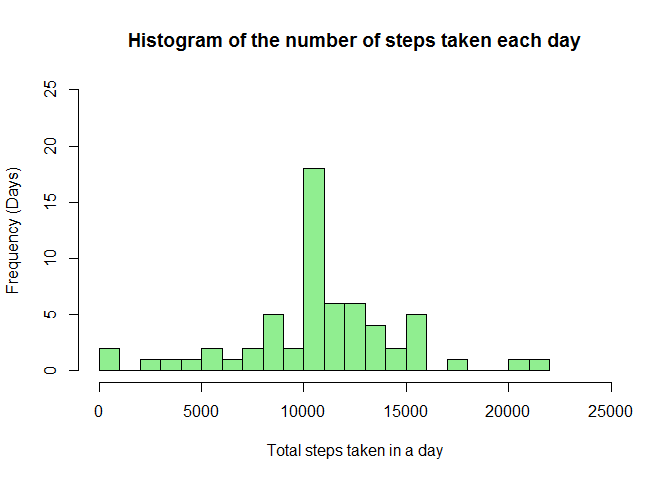

## 1. Loading and preprocessing the data
The following code was used to load the activity monitoring data into R.  The data was stored in a data table called **Actdata** and loaded directly from the zipped file.


```r
        library(readr)
        Actdata <- read_csv("activity.zip")
```


## 2. What is mean total number of steps taken per day?

### 2.1 Calculate the total number of steps taken per day.

The data was grouped by day, then the total number of steps was calculated for each day and stored in  **sumStepsDay**.


```r
        library(dplyr)

        ## Calculate the total number of steps by date
        sumStepsDay <-
                Actdata %>%
                group_by(date) %>%
                summarize(steps = sum(steps))
```

### 2.2 Make a histogram of total number of steps taken each day

**sumStepsDay** was used to create a histogram showing the frequency of total steps taken in a day.


```r
        # Plot the histogram of steps taken each day
        hist(sumStepsDay$steps, col = "skyblue", xlim = c(0, 25000), ylim = c(0, 20), breaks = 20, 
             xlab = "Total steps taken in a day", ylab = "Frequency (Days)", 
             main = "Histogram of the number of steps taken each day")
```

<!-- -->

### 2.3 Calculate the mean and median of the total number of steps

The **mean** and **median** number of steps were calculated using the following statements.


```r
        mean(sumStepsDay$steps, na.rm = TRUE)
```

```
## [1] 10766.19
```

```r
        median(sumStepsDay$steps, na.rm = TRUE)
```

```
## [1] 10765
```


## 3. What is the average daily activity pattern?

The daily activity pattern refers to the average number of steps for each time interval across all days.

### 3.1 Make a time series plot of 5-minute intervals and average steps taken
The data was grouped by the interval, then the average steps was calculated for each interval across all days.


```r
        # Calculate the average number of steps for each interval
        avgStepsInt <-
                Actdata %>%
                group_by(interval) %>%
                summarize(avgSteps = mean(steps, na.rm = TRUE))
        
        # Make time series plot
        library(ggplot2)
        ggplot(avgStepsInt, aes(x = interval, y = avgSteps)) +
                        geom_line(size = 1, colour = "dark blue") +
                        scale_x_continuous(breaks = seq(0, 2400, by = 200)) +
                        xlab("Interval") +
                        ylab("Average number of steps") +
                        ggtitle("Average Daily Activity by Interval")
```

<!-- -->

### 3.2 Interval which contains the maximum number of steps

The interval **835** contains the maximum average number of steps.


```r
avgStepsInt[avgStepsInt$avgSteps == max(avgStepsInt$avgSteps),]
```

```
## # A tibble: 1 x 2
##   interval avgSteps
##      <dbl>    <dbl>
## 1      835     206.
```


## 4. Imputing missing values
In this dataset missing information was denoted by NA. Sometimes missing information can introduce bias into calculations or summaries of data.  As a result the NA's were replaced by estimated values and further analysed. 

### 4.1 Total number of missing values in the dataset
The total number of rows with 'NA's is **2304**.


```r
        sum(!complete.cases(Actdata))
```

```
## [1] 2304
```

### 4.2 Filling in missing values in the dataset
The NAs in the dataset were replaced by the average number of steps for that particular interval.  The average numbers of steps for each interval have already been calculated and stored in the table **avgStepsInt**.


```r
        # The column, imputSteps, was added to the original data.  If the value in the 'steps' 
        # column is NA, imputSteps takes the value of the average steps calculated previously for
        # the corresponding interval, else imputSteps takes the value from the 'steps' column.

        Actdata <- transform(Actdata, imputSteps = ifelse(is.na(steps), 
                                avgStepsInt$avgSteps[match(Actdata$interval, avgStepsInt$interval)],                                 steps))
```

### 4.3 Create a new dataset equivalent to the original with missing data filled in
The new, imputed dataset with no missing data was created by selecting all columns from the original data, except for the **steps** column which contains NAs.  The new column **imputSteps** replaced **steps**.


```r
        newdata <- select(Actdata, -steps)
        newdata <- rename(newdata, steps = imputSteps)
```

### 4.4 Make a histogram of total steps taken & compare with the original data
The total steps per day was calculated using the imputed data and this was used to create a histogram.


```r
        #Re-calculate total steps per day with newdata
        newSumStepsDay <-
                newdata %>%
                group_by(date) %>%
                summarize(steps = sum(steps))

        #Plot histogram
        hist(newSumStepsDay$steps, col = "light green", xlim = c(0, 25000), ylim = c(0, 25), 
             breaks = 20, xlab = "Total steps taken in a day", 
             ylab = "Frequency (Days)", main = "Histogram of the number of steps taken each day")
```

<!-- -->

The mean and median of total steps taken per day from the imputed data are provided below.

```r
        mean(newSumStepsDay$steps, na.rm = TRUE)
```

```
## [1] 10766.19
```

```r
        median(newSumStepsDay$steps, na.rm = TRUE)
```

```
## [1] 10766.19
```

The mean value remained the same at **10766.19** for the imputed data.  The median increased only slightly from 10765 to **10766.19**.  Note that with the imputed data both the mean and the median are identical. 

It therefore seems as if imputing the missing data had no effect on the estimates of the total daily number of steps. 


## 5. Are there differences in activity patterns between weekdays and weekends?
This section checks whether daily activity differs on weekends compared to weekdays.


### 5.1 Create a new factor variable in the dataset
A new variable was added to the dataset to separate the data into 2 categories: **weekend** if the date falls on a Saturday or Sunday, and **weekday** if it falls during the week.


```r
 newdata <- mutate(newdata, daycat = factor(ifelse(weekdays(date) %in% c("Saturday", "Sunday"), "weekend", "weekday")))
```

### 5.2 Make a panel plot containing a time series plot of interval and average steps taken
The imputed data was grouped by interval then by day category (ie. weekend or weekday).  The average number of steps was calculated for each group across all days.


```r
        # Calculate average steps by interval and day category
        avgStepsInt <-
                newdata %>%
                group_by(interval, daycat) %>%
                summarize(avgSteps = mean(steps))
        
        # Panel plot comparing day category ie. weekend and weekday
        ggplot(avgStepsInt, aes(interval, avgSteps, color = daycat)) +
                geom_line(size = 0.75) +
                facet_grid(daycat ~ .) +
                xlab("Interval") +
                ylab("Average number of steps") +
                ggtitle("Average number of steps by interval")
```

<!-- -->
